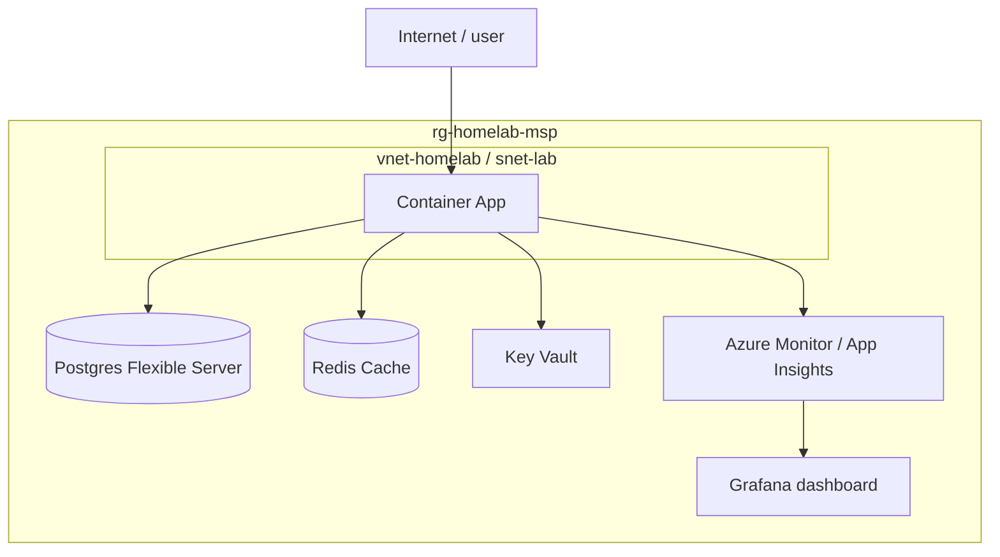

# Lab 01: Container Apps + Postgres + Redis + observability

A small API deployed to Azure Container Apps, backed by Postgres Flexible Server and Redis Cache, with Azure Monitor alerting and a Grafana dashboard. Provisioned end-to-end with Bicep and a GitHub Actions pipeline.

## Architecture Overview

Traffic enters the Container App through ingress. The app reads/writes to Postgres, caches through Redis, and pulls secrets from Key Vault. Azure Monitor and Application Insights collect telemetry and feed a Grafana dashboard.

## What's here

- `infra/` — Bicep templates for the resource group, networking, Container Apps environment, Postgres, Redis, and Monitor alerts
- `app/` — the sample API and its Dockerfile
- `.github/workflows/` — CI/CD pipeline: build, push, plan, apply
- `logs/` — session-by-session build logs

## Build logs

- [Session 0: Foundation](logs/session-00-foundation.md)
- [Session 1: Container Apps](logs/session-01-container-apps.md)
- [Session 2: Postgres](logs/session-02-postgres.md)
- [Session 3: Redis](logs/session-03-redis.md)
- [Session 4: Observability](logs/session-04-observability.md)
- [Session 5: IaC + CI/CD](logs/session-05-iac-cicd.md)

## Key decisions worth reading

- **Postgres on private access, not a public endpoint** — see Session 2 log for the reasoning
- **Alert thresholds were chosen deliberately, not left at defaults** — see Session 4 log for how they were set and validated by deliberately breaking the app