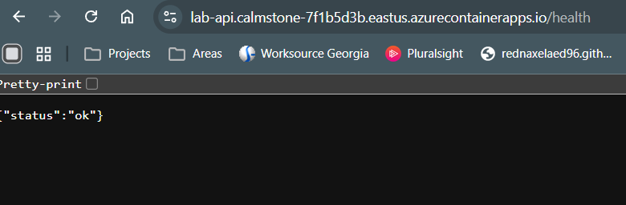
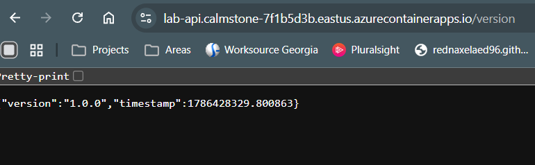
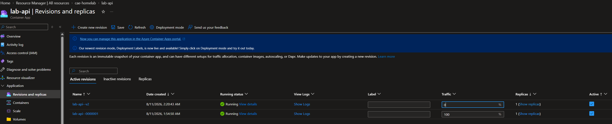
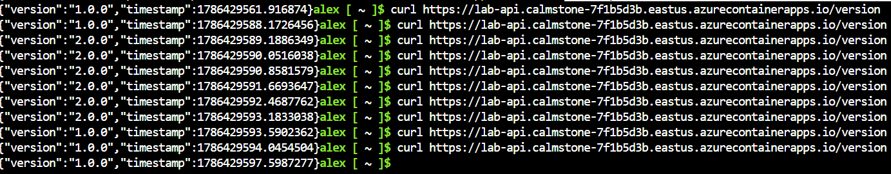
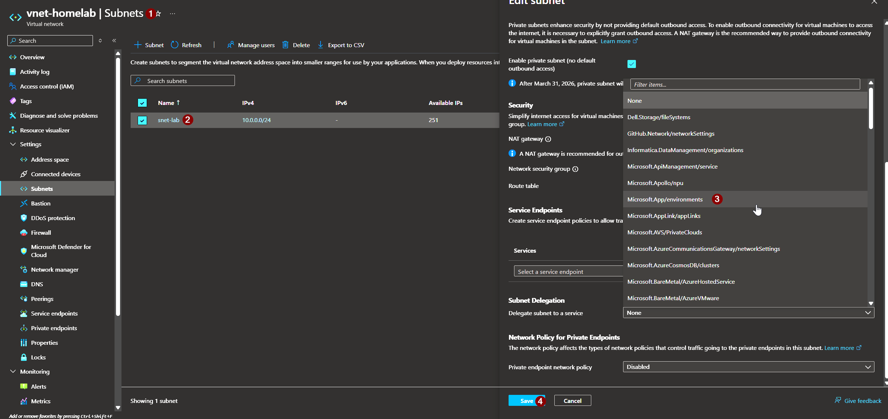

# Step 1: Prerequisites
    - Created a small python app that will get version and health information for testing purposes using FastAPI
    - Created the requirements.txt needed for the Dockerfile.
    - Created the dockerfile to be pushed to the ACR created in the previous session.

# Step 2: Push Dockerfile
In a local terminal in the root directory of this lab, I ran the following Azure CLI command to push the initial image:
```azurecli
az acr build \
  --registry <your-acr-name> \
  --image lab-api:v1 \
  ./app
```
Verified the repo was created in the Azure ACR


# Step 3: Creating the Container App Environment
Ran the following command in Azure CLI using a bash cloud shell to create the container app envionrment:
```azurecli
az containerapp env create \
  --name cae-homelab \
  --resource-group rg-homelab-msp \
  --location eastus \
  --infrastructure-subnet-resource-id \
    $(az network vnet subnet show \
        --resource-group rg-homelab-msp \
        --vnet-name vnet-homelab \
        --name snet-lab \
        --query id -o tsv) \
  --logs-workspace-id ***REMOVED*** \
  --logs-workspace-key ***REMOVED***
```

# Step 4: Deploying the Container App
I used the following Azure CLI command to deploy the container app:
```azurecli
az identity create \
  --resource-group rg-homelab-msp \
  --name id-acr-pull

identityId=$(az identity show \
  --resource-group rg-homelab-msp \
  --name id-acr-pull \
  --query id -o tsv)

principalId=$(az identity show \
  --resource-group rg-homelab-msp \
  --name id-acr-pull \
  --query $principalId -o tsv)

acrId=$(az acr show --name acrhomelabakd --resource-group rg-homelab-msp --query id -o tsv)

az role assignment create \
  --assignee-object-id $principalId \
  --assignee-principal-type ServicePrincipal \
  --role AcrPull \
  --scope $acrId

az containerapp create \
  --name lab-api \
  --resource-group rg-homelab-msp \
  --environment cae-homelab \
  --user-assigned $identityId \
  --registry-identity $identityId \
  --registry-server acrhomelabakd.azurecr.io \
  --image acrhomelabakd.azurecr.io/lab-api:v1 \
  --target-port 8000 \
  --ingress external \
  --min-replicas 1 \
  --max-replicas 3
  ```

# Step 5: Verify Functionality
After getting the application URL from the Container App, ran the following commands to the health and version endpoints to ensure the app is functioning properly:
```bash
curl https://lab-api.calmstone-7f1b5d3b.eastus.azurecontainerapps.io/health
curl https://lab-api.calmstone-7f1b5d3b.eastus.azurecontainerapps.io/version
```

The URLs in the bash command can also be visited via web browser to confirm.




# Step 6: Deliberate Revision + Traffic Split
While we kind of did this already due to my typo in step 2 during the initial repo build, I think it is still good to show a full cutover. Lets update the version to 2.0.

We'll start by updating the version string in main.py
## Before
```python
@app.get("/version")
def version():
    return {"version": "1.0.0", "timestamp": time.time()}
```
## After
```python
@app.get("/version")
def version():
    return {"version": "2.0.0", "timestamp": time.time()}
```

Once saved, I will use my local terminal to enable multiple revisions and build the v2 repo:
```azurecli
az containerapp revision set-mode \
  --name lab-api \
  --resource-group rg-homelab-msp \
  --mode multiple

az containerapp update \
  --name lab-api \
  --resource-group rg-homelab-msp \
  --image acrhomelabakd.azurecr.io/lab-api:v2 \
  --revision-suffix v2

az acr build \
  --registry acrhomelabakd \
  --image lab-api:v2 \
  ./app
```

After confirming both revisions are healthy and provisioned and that traffic was not cutover , I split the traffic between them 50/50 rather than the 0/100 and hit the version endpoint multiple times to ensure I saw both v1 and v2. Once I confirmed both, I put traffic fully to v2.





## Issues
### Step 3
This initially failed due to there not being an applicable Log Analytics Workspace, and it being unable to create one due to the Microsoft.OperationalInsights resource provider not being registered on my subscription. I ran ```az provider register -n Microsoft.OperationalInsights --wait``` to resolve this issue.

On the next run, I got an error stating ```(ManagedEnvironmentSubnetDelegationError) The subnet of the environment must be delegated to the service 'Microsoft.App/environments'.```. I resolved this through the portal by going to snet-lab and adding the Microsoft.App/environments service under Subnet Delegation. This could also be remediated via Azure CLI using the following command:

```azurecli
az network vnet subnet update \
  --resource-group rg-homelab-msp \
  --vnet-name vnet-homelab \
  --name snet-lab \
  --delegations Microsoft.App/environments
  ```
  

At this point I noticed that the command would create its own log analytics workspace with a randomly generated name, but this won't match the naming convention outlined in the root of this lab of resourceacronym-(lab or homelab)
  Updated original CLI command to add the ```--logs-workspace-id <log-analytics-customer-id>``` and ```--logs-workspace-key <log-analytics-shared-key>``` commands so I could specify a log analytics workspace that matches my naming convention and reran command. Ran the below 2 commands to get the necessary info:

  ```azurecli
  # Customer ID (workspace ID)
az monitor log-analytics workspace show \
  --resource-group rg-homelab-msp \
  --workspace-name law-homelab \
  --query customerId -o tsv

# Shared key (primary key)
az monitor log-analytics workspace get-shared-keys \
  --resource-group rg-homelab-msp \
  --workspace-name law-homelab \
  --query primarySharedKey -o tsv
  ```
  ### Step 4
  #### Initial command failure (idetity issue)
  I came across the following error the first time I ran the CLI command: "Failed to retrieve credentials for container registry acrhomelabakd. Please provide the registry username and password". The quick fix would be to enable admin credentials. However, in the spirit of least privilege access and in order to integrate some SSO into this lab, I think it's time we setup Entra ID integration and then assign a managed identity to the container registry with a scoped AcrPull. This identity shouldn't be able to push or manage Acr, it should ONLY pull. If this functionality needs to be added later, it can be modified by someone with the access to do so (me in this case).
  
  See below for the initial failing command:

```azurecli
az containerapp create \
  --name lab-api \
  --resource-group rg-homelab-msp \
  --environment cae-homelab \
  --image acrhomelabakd.azurecr.io/lab-api:v1 \
  --registry-server acrhomelabakd.azurecr.io \
  --target-port 8000 \
  --ingress external \
  --min-replicas 1 \
  --max-replicas 3
  ```

  #### New command failure
  Upon running the newly updated command, I got this error: 
  
  ```Failed to provision revision for container app 'lab-api'. Error details: The following field(s) are either invalid or missing. Field 'template.containers.lab-api.image' is invalid with details: 'Invalid value: "acrhomelabakd.azurecr.io/lab-api:v1": GET https:: MANIFEST_UNKNOWN: manifest tagged by "v1" is not found; map[Tag:v1]';..```

Upon investigating, it seems that when the repo was pushed in Step 2, it was tagged improperly. Going back, this was a typo on my end. Just to keep things clean, I deleted the old repo and rebuilt the repo with the proper tag, then ran a quick update on the container app to update the repo from vi to v1. See commands below:

```azurecli
# Update Container App to new tag
az containerapp update \
  --name lab-api \
  --resource-group rg-homelab-msp \
  --image acrhomelabakd.azurecr.io/lab-api:v1

# Remove the old 'vi' tag
az acr repository untag \
  --name acrhomelabakd \
  --image lab-api:vi

# Delete the manifest to make the environment look more clean
az acr repository delete \
  --name acrhomelabakd \
  --image lab-api@sha256:22bfe4b912e8fdec6169c543f73479751b61e18d7d1efe976ad33e9f920aea9c \
  --yes
```
