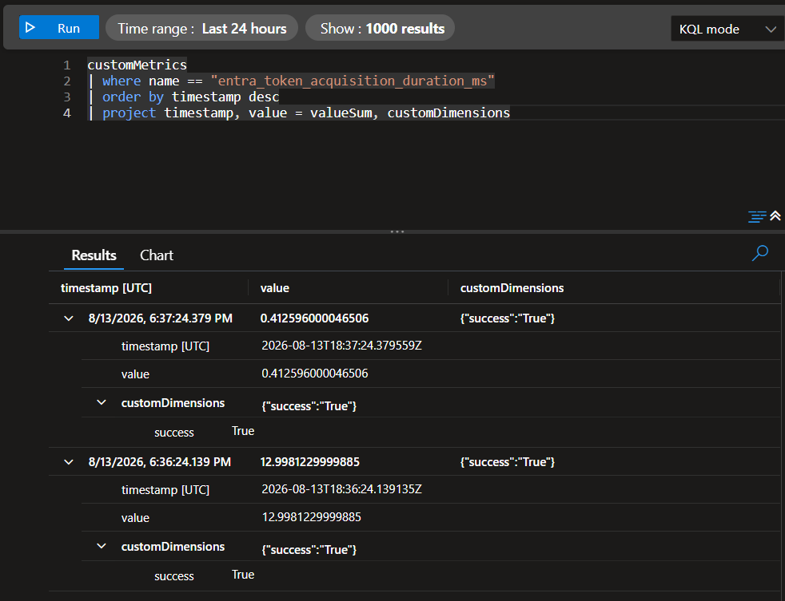

# Setup: App Insights and Monitor on Lab-Api
I started this step by creating a new application insight resource called "appins-labapi-homelab" and set it to send logs to the workspace we created in session 2, "law-homelab". From monitor, I also created a diagnostic setting on the lab-api app called "LabapiMetricsToMonitor" that sends AllMetrics to "law-homelab". Then, we need to add the requirements to the app.

# Step 1: Configuring Monitor in the App
For the requirements.txt in the app, we added the "azure-monitor-opentelemetry" requirement. This is the standard for enabling telemetry on the app. Next, in the app itself, we updated lines 1-41 to:
```python
import os
import time
import psycopg2
from fastapi import FastAPI
from azure.identity import ManagedIdentityCredential
from azure.monitor.opentelemetry import configure_azure_monitor
from opentelemetry import metrics

configure_azure_monitor(
    connection_string=os.environ["APPLICATIONINSIGHTS_CONNECTION_STRING"]
)

app = FastAPI()
credential = ManagedIdentityCredential(client_id=os.environ["PG_IDENTITY_CLIENT_ID"])

meter = metrics.get_meter("lab-api")
token_duration_histogram = meter.create_histogram(
    "entra_token_acquisition_duration_ms",
    unit="ms",
    description="Time to acquire an Entra ID token for Postgres authentication",
)

def get_connection():
    start = time.monotonic()
    success = True
    try:
        token = credential.get_token("https://ossrdbms-aad.database.windows.net/.default")
    except Exception:
        success = False
        raise
    finally:
        duration_ms = (time.monotonic() - start) * 1000
        token_duration_histogram.record(duration_ms, {"success": str(success)})

    return psycopg2.connect(
        host=os.environ["DB_HOST"],
        dbname=os.environ["DB_NAME"],
        user=os.environ["DB_USER"],
        password=token.token,
        sslmode="require",
    )
```
I imported azure monitor and metrics from azure-monitor-opentelemetry and used the connection string of the app insights resource I created earlier for authentication to turn on the FastAPI instrumentation. The I made a custom metric called entra_token_acquisition_duration_ms as something I can track, since this was an issue in the last session and may be something worth monitoring. A histogram can give me a better idea if, down the line, say I wanted to investigate if the cold-start race was actually fixed, it would give me a much clearer picture of whether it is fixed than a counter.

After I was done with the changes, I updated the build and pushed it with the v7 tag. After this, I then updated our yaml file and added an environment variable for the connection string we are using in the app. However, I realized that the full string was not something I wanted to commit to git, so I did something I should have done a long time ago; I added our yaml to a .gitignore file so that I don't commit any portential secrets. Since I had committed the yaml before in earlier sessions, I went ahead and removed the cached yaml file and committed the untracking, then confirmed that it is ignored properly before committing my yaml, app, and requirements.txt files again.

Back in azure, once I confirmed the revision was created, I confirmed it was running properly (no issues this time around) and sent 100% traffic to it. I then ran a few curl commands to the /notes endpoint, and after a few minutes, I ran the following KQL query against the application insight resource
```kusto
customMetrics
| where name == "entra_token_acquisition_duration_ms"
| order by timestamp desc
```
This showed results, but I wanted to only project a few of the columns, so I landed on this final query for my logs:
```kusto
customMetrics
| where name == "entra_token_acquisition_duration_ms"
| order by timestamp desc
| project timestamp, value = valueSum, customDimensions
```


These results show that the connections succeeded, and show in milliseconds how long each connection took.

# Step 2: Setting up Grafana Dashboard
In most cases I would prefer to test setting up Azure Managed Grafana. However, Microsoft has retired the free/cheap "Essential" tier of this, and I only have the option for standard, which would be far too costly for a home lab setup. Due to this, I am going with the Microsoft recommended replacement of Azure Monitor Dashboards with Grafana. I will miss out on the experience of setting up a standalone instance of Grafana with this, but I will still get the benefits of being able to use the same dashboard engine, same query language, and the connection to my log analytics and insights data will be native.

This is easy enough to setup and access.
1. Go to your Application Insights resource, Monitoring, and go to Dashboards with Grafana.
2. Select New and select New Dashboard.

This will show us the Grafana editing interface and it will be automatically connected to my monitor data.
I tried to set up a panel for availability, but this was showing me no data. To double check, I tried to run a simple request query against my app insights, but that came back empty as well.

